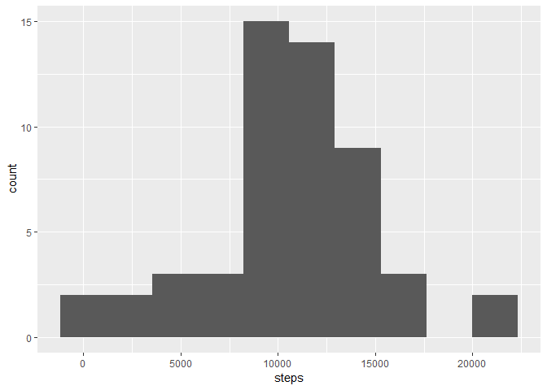
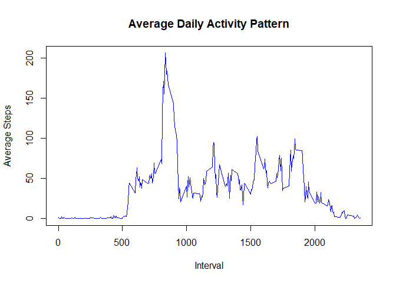

### Introduction

It is now possible to collect a large amount of data about personal movement using activity monitoring devices such as a [Fitbit](http://www.fitbit.com/), [Nike Fuelband](http://www.nike.com/us/en_us/c/nikeplus-fuelband), or [Jawbone Up](https://jawbone.com/up). These type of devices are part of the “quantified self” movement – a group of enthusiasts who take measurements about themselves regularly to improve their health, to find patterns in their behavior, or because they are tech geeks. But these data remain under-utilized both because the raw data are hard to obtain and there is a lack of statistical methods and software for processing and interpreting the data.

This assignment makes use of data from a personal activity monitoring device. This device collects data at 5 minute intervals through out the day. The data consists of two months of data from an anonymous individual collected during the months of October and November, 2012 and include the number of steps taken in 5 minute intervals each day.

The data for this assignment can be downloaded from the course web site:

- Dataset: [Activity monitoring data](https://d396qusza40orc.cloudfront.net/repdata%2Fdata%2Factivity.zip)


```r
# Download zip file
url <- "https://d396qusza40orc.cloudfront.net/repdata%2Fdata%2Factivity.zip"
if (!file.exists("activity.zip")) {
    download.file(url, "activity.zip", mode = "wb")
}

# Unzip zip file
unzip("activity.zip")
```

### Loading and preprocessing the data
First, I'll load the data and convert the date to correct format:


```r
# Load the data
activity <- read.csv("activity.csv")
activity$date <- as.Date(activity$date, "%Y-%m-%d")
```
Now, I do a bit of data exploration:

We see that there are a total of 17,568 observations and three variables in this dataset.

```r
dim(activity)
```

```
## [1] 17568     3
```

The variables included in this dataset are:


```r
names(activity)
```

```
## [1] "steps"    "date"     "interval"
```

- **steps**: Number of steps taking in a 5-minute interval (missing values are coded as NA)
- **date**: The date on which the measurement was taken in YYYY-MM-DD format
- **interval**: Identifier for the 5-minute interval in which measurement was taken

### What is mean total number of steps taken per day?

For this part of the assignment, I'll ignore the missing values in the dataset.

First I **calculate the total number of steps taken per day**:


```r
totalStepsPerDay <- aggregate(steps ~ date, activity, sum) 
head(totalStepsPerDay) # The default for aggregate is to ignore missing values in the given variables
```

```
##         date steps
## 1 2012-10-02   126
## 2 2012-10-03 11352
## 3 2012-10-04 12116
## 4 2012-10-05 13294
## 5 2012-10-06 15420
## 6 2012-10-07 11015
```

Now, I make a **histogram of the total number of steps taken each day**:

```r
library(ggplot2)
ggplot(totalStepsPerDay, aes(x = steps)) + geom_histogram(bins = 10)
```

<!-- -->

Finally, I **calculate the mean and median of the total number of steps taken per day**:

The mean of the total number of steps taken per day is given as:

```r
meanTotalStepsPerDay <- mean(totalStepsPerDay$steps, na.rm = TRUE)
meanTotalStepsPerDay
```

```
## [1] 10766.19
```
The median of the total number of steps taken per day is given as:

```r
medianTotalStepsPerDay <-median(totalStepsPerDay$steps, na.rm = TRUE)
medianTotalStepsPerDay
```

```
## [1] 10765
```

We see that the mean and the median are very close to each other. 

**Note:** In my approach, I used the *aggregate()* function, which just ignores/removes the rows where steps variable has a missing value. However, if we use *tapply()* function instead, then we can have two alternatives in how we proceed. Both will give difference result.

1- Use tapply() with na.rm = TRUE and then calculate mean.

```r
test1 <- tapply(activity$steps, activity$date, sum, na.rm = TRUE)
mean(test1)
```

```
## [1] 9354.23
```

```r
median(test1)
```

```
## [1] 10395
```

2- Use tapply and then calculate mean with na.ra = TRUE. (This gives the same result as the *aggregate()* function.)


```r
test2 <- tapply(activity$steps, activity$date, sum)
mean(test2, na.rm = TRUE)
```

```
## [1] 10766.19
```

```r
median(test2, na.rm = TRUE)
```

```
## [1] 10765
```

I believe that the second approach above is the correct one, and I'll stick with it during this assignment.

### What is the average daily activity pattern?
Now we look at the average daily activity pattern.

First, I make a **time series plot of the 5-minute interval and the average number of steps taken, averaged across all days**


```r
avgStepsPerInterval <- aggregate(steps ~ interval, activity, mean)
plot(x = avgStepsPerInterval$interval, y = avgStepsPerInterval$steps, type='l', 
     xlab = "Interval", ylab = "Average Steps", main = "Average Daily Activity Pattern", col = "blue")
```

<!-- -->

Then, I find **the 5-minute interval, on average across all the days in the dataset, that contains the maximum number of steps**:


```r
avgStepsPerInterval[which.max(avgStepsPerInterval$steps), ]$interval
```

```
## [1] 835
```

### Imputing missing values

First I **calculate the total number of missing values in the dataset**:


```r
sum(is.na(activity))
```

```
## [1] 2304
```

```r
colSums(is.na(activity))
```

```
##    steps     date interval 
##     2304        0        0
```

We see that there are missing values in the *steps* variable. There can be many **strategies for filling in all of the missing values in the dataset**. For example:

- We could use the mean/median for that day.
- We could use the mean for that 5-minute interval.
- We could just replace all missing values with zeros.

For this assignment, __I have decided to use the mean for the 5-minute interval__.

I **create a new dataset that is equal to the original dataset but with the missing data filled in**:


```r
activity2<-activity
for(i in 1:nrow(activity2)){
    if(is.na(activity2[i,]$steps)){
        activity2[i,]$steps <- avgStepsPerInterval[avgStepsPerInterval$interval==activity2[i,]$interval,]$steps
    }
}
```

Then, I verify that there are no missing values in the dataset:


```r
colSums(is.na(activity2))
```

```
##    steps     date interval 
##        0        0        0
```

Then, I again make a **histogram of the total number of steps taken each day** and **calculate the mean and median total number of steps taken per day**. 


```r
totalStepsPerDay2 <- aggregate(steps ~ date, activity2, sum)
ggplot(totalStepsPerDay, aes(x = steps)) + geom_histogram(bins = 10)
```

<!-- -->

```r
meanTotalStepsPerDay2 <- mean(totalStepsPerDay2$steps, na.rm = TRUE)
meanTotalStepsPerDay2
```

```
## [1] 10766.19
```

```r
medianTotalStepsPerDay2 <-median(totalStepsPerDay2$steps, na.rm = TRUE)
medianTotalStepsPerDay2
```

```
## [1] 10766.19
```

We see that, compared to the first part of the assignment, now our mean and median are equal. 

### Are there differences in activity patterns between weekdays and weekends?

In this section, we use the dataset with the filled-in missing values, i.e. activity2.

First, I **create a new factor variable in the dataset with two levels – “weekday” and “weekend” indicating whether a given date is a weekday or weekend day**:


```r
activity2$day <- ifelse(as.POSIXlt(activity2$date)$wday%%6 == 0, "weekend", "weekday")
activity2$day <- factor(activity2$day,levels=c("weekday","weekend"))
```

Then, I make use of the **lattice** package to **create a panel plot containing a time series plot of the 5-minute interval and the average number of steps taken, averaged  across all weekday days or weekend days**. 


```r
library(lattice)
avgStepsPerInterval2 <- aggregate(steps~interval+day, activity2, mean)
xyplot(steps~interval|factor(day), data=avgStepsPerInterval2, aspect=1/2, type="l")
```

<!-- -->

We can see from plots that the activity patterns between weekdays and weekends differ. For weekdays, we see a clear peak in the morning. During the weekends, the activity is more or less uniform. 
